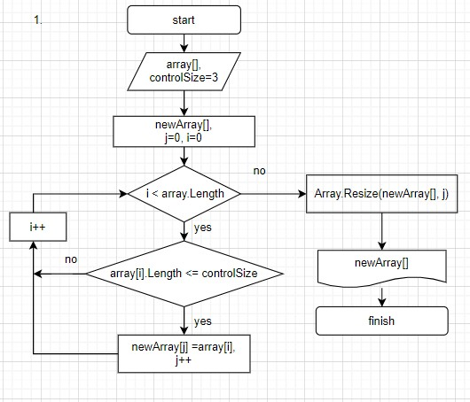

# Итоговая проверочная работа.

## Задача.

Написать программу, которая из имеющегося массива строк формирует массив из строк, длина которых меньше, либо равна 3 символам. Первоначальный массив можно ввести с клавиатуры, либо задать на старте выполнения алгоритма.
При решении не рекомендуется пользоваться коллекциями, лучше обойтись исключительно массивами.

## Описание алгоритма решения задачи.

Задача решена двумя способами:

+ Способ 1.
    * Пользователь вводит количество строк и элементы строчного массива.
    * Создаем новый массив такого же размера, как и массив пользователя и переменную j.
    * Проверяем в цикле for элементы пользовательского массива, если длинна элемента меньше или равна 3, записываем элемент в новый массив и увеличиваем переменную j.
    * С помощью метода Array.Resize изменяем количество элементов в новом массиве до величины j.
    * Выводим новый массив в терминал.

### Блок схема алгоритма.

+ Способ 2.
    * Пользователь вводит количество строк и элементы строчного массива.
    * Создаем новую переменную size.
    * Проверяем в цикле for элементы пользовательского массива, если длинна элемента меньше или равна 3, увеличиваем переменную size на 1.
    * По завершению цикла получаем size, размер нового массива.
    * Создаем новый массив размера size и переменную j.
    * Проверяем в цикле for элементы пользовательского массива, если длинна элемента меньше или равна 3, записываем элемент в новый массив и увеличиваем переменную j.
    * Выводим новый массив в терминал.

### Блок схема алгоритма.

## Код задачи.
Код задачи расположен в папке ControlTask, файл Program.cs.